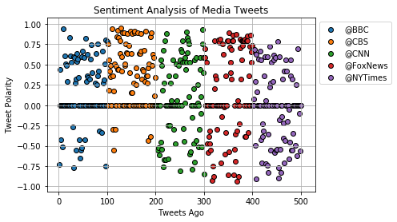
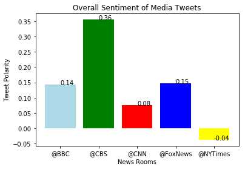

```python
#Dependencies.

import tweepy
import json
import pandas as pd
import numpy as np
import time
from datetime import datetime
import matplotlib.pyplot as plt
import seaborn as sns

# Import and Initialize Sentiment Analyzer.
from vaderSentiment.vaderSentiment import SentimentIntensityAnalyzer
analyzer = SentimentIntensityAnalyzer()
```


```python
#Twitter API keys
consumer_key = "VkbJrK9u2sx7a1nKpRfpIEZ12"
consumer_secret = "gdCKTJqHDZgh4kVnIXWHKbNwl9xy2esuZ0BgGFvqAd9gR8sMty"
access_token = "3236025188-o5LcnEEN3J0NgDBy3NlKEzvb2XVMbpYaEIqE7bw"
access_token_secret = "oApN3W0P5G960Mx2WXdJfPxlTuVnUi7j7v4N9OtWKWzGk"
```


```python
# Tweepy API Authentication.

auth = tweepy.OAuthHandler(consumer_key, consumer_secret)
auth.set_access_token(access_token, access_token_secret)
api = tweepy.API(auth, parser=tweepy.parsers.JSONParser())
```


```python
# Get tweets from each news organization

target_users = ("@BBC", "@CBS", "@CNN", "@FoxNews", "@NYTimes")

# Counter
counter = 1

# Variables for holding sentiments
sentiments = []


# Loop through 5 pages of tweets (total 100 tweets)
for user in target_users:

    # Get all tweets from home feed
    public_tweets = api.user_timeline(user, count = 100)

    # Loop through all tweets 
    for tweet in public_tweets:

        
        # Run Vader Analysis on each tweet
        results = analyzer.polarity_scores(tweet["text"])
        compound = results["compound"]
        pos = results["pos"]
        neu = results["neu"]
        neg = results["neg"]
        tweets_ago = counter
        
               
        # Add sentiments for each tweet into a list
        sentiments.append({ "User" : user,
                            "Date": tweet["created_at"], 
                           "Compound": compound,
                           "Positive": pos,
                           "Negative": neu,
                           "Neutral": neg,
                           "Tweets Ago": counter,
                           "Tweet Text" : tweet['text']
                          })
        
        # Add to counter 
        counter += 1


```


```python
#Create DataFrame.

news_sentiments_results = pd.DataFrame.from_dict(sentiments)
news_sentiments_results
```


<div>
<style scoped>
    .dataframe tbody tr th:only-of-type {
        vertical-align: middle;
    }

    .dataframe tbody tr th {
        vertical-align: top;
    }

    .dataframe thead th {
        text-align: right;
    }
</style>
<table border="1" class="dataframe">
  <thead>
    <tr style="text-align: right;">
      <th></th>
      <th>Compound</th>
      <th>Date</th>
      <th>Negative</th>
      <th>Neutral</th>
      <th>Positive</th>
      <th>Tweet Text</th>
      <th>Tweets Ago</th>
      <th>User</th>
    </tr>
  </thead>
  <tbody>
    <tr>
      <th>0</th>
      <td>-0.7351</td>
      <td>Wed Jun 27 20:01:05 +0000 2018</td>
      <td>0.733</td>
      <td>0.267</td>
      <td>0.000</td>
      <td>A raw and unfiltered insight into the bloodies...</td>
      <td>1</td>
      <td>@BBC</td>
    </tr>
    <tr>
      <th>1</th>
      <td>0.4404</td>
      <td>Wed Jun 27 19:02:01 +0000 2018</td>
      <td>0.637</td>
      <td>0.121</td>
      <td>0.242</td>
      <td>😂  @Cher's "criminal" past is 😳...\n#TheGNShow...</td>
      <td>2</td>
      <td>@BBC</td>
    </tr>
    <tr>
      <th>2</th>
      <td>0.0000</td>
      <td>Wed Jun 27 18:00:25 +0000 2018</td>
      <td>1.000</td>
      <td>0.000</td>
      <td>0.000</td>
      <td>🎧 Can you believe DJ Switch only started DJ-in...</td>
      <td>3</td>
      <td>@BBC</td>
    </tr>
    <tr>
      <th>3</th>
      <td>-0.4215</td>
      <td>Wed Jun 27 16:04:05 +0000 2018</td>
      <td>0.741</td>
      <td>0.259</td>
      <td>0.000</td>
      <td>Something deadly lies beneath the ice in Icela...</td>
      <td>4</td>
      <td>@BBC</td>
    </tr>
    <tr>
      <th>4</th>
      <td>0.0000</td>
      <td>Wed Jun 27 15:09:27 +0000 2018</td>
      <td>1.000</td>
      <td>0.000</td>
      <td>0.000</td>
      <td>🕺 *Knight Fever* \n\nBee Gee Sir Barry Gibb pa...</td>
      <td>5</td>
      <td>@BBC</td>
    </tr>
    <tr>
      <th>5</th>
      <td>0.0000</td>
      <td>Wed Jun 27 14:42:13 +0000 2018</td>
      <td>1.000</td>
      <td>0.000</td>
      <td>0.000</td>
      <td>RT @bbccomedy: Some writing advice from an exp...</td>
      <td>6</td>
      <td>@BBC</td>
    </tr>
    <tr>
      <th>6</th>
      <td>0.0000</td>
      <td>Wed Jun 27 13:05:07 +0000 2018</td>
      <td>1.000</td>
      <td>0.000</td>
      <td>0.000</td>
      <td>French butchers have written to the government...</td>
      <td>7</td>
      <td>@BBC</td>
    </tr>
    <tr>
      <th>7</th>
      <td>-0.5106</td>
      <td>Wed Jun 27 11:52:00 +0000 2018</td>
      <td>0.650</td>
      <td>0.350</td>
      <td>0.000</td>
      <td>☕️ How a simple change is cutting coffee cup w...</td>
      <td>8</td>
      <td>@BBC</td>
    </tr>
    <tr>
      <th>8</th>
      <td>0.9403</td>
      <td>Wed Jun 27 11:39:52 +0000 2018</td>
      <td>0.536</td>
      <td>0.000</td>
      <td>0.464</td>
      <td>RT @BBCBreakfast: Dear Summer, ☀️\nWe're enjoy...</td>
      <td>9</td>
      <td>@BBC</td>
    </tr>
    <tr>
      <th>9</th>
      <td>0.0000</td>
      <td>Wed Jun 27 11:03:04 +0000 2018</td>
      <td>1.000</td>
      <td>0.000</td>
      <td>0.000</td>
      <td>🦔🧙 Did you know people used to think hedgehogs...</td>
      <td>10</td>
      <td>@BBC</td>
    </tr>
    <tr>
      <th>10</th>
      <td>0.0000</td>
      <td>Wed Jun 27 09:30:20 +0000 2018</td>
      <td>1.000</td>
      <td>0.000</td>
      <td>0.000</td>
      <td>😐 This is what happens when you hire an arts a...</td>
      <td>11</td>
      <td>@BBC</td>
    </tr>
    <tr>
      <th>11</th>
      <td>0.6114</td>
      <td>Wed Jun 27 08:47:40 +0000 2018</td>
      <td>0.756</td>
      <td>0.050</td>
      <td>0.194</td>
      <td>RT @BBCArchive: Computer geeks - this is your ...</td>
      <td>12</td>
      <td>@BBC</td>
    </tr>
    <tr>
      <th>12</th>
      <td>0.0000</td>
      <td>Wed Jun 27 08:01:05 +0000 2018</td>
      <td>1.000</td>
      <td>0.000</td>
      <td>0.000</td>
      <td>👟 @MumsnetTowers founder @Justine_Roberts on w...</td>
      <td>13</td>
      <td>@BBC</td>
    </tr>
    <tr>
      <th>13</th>
      <td>0.5106</td>
      <td>Wed Jun 27 07:29:04 +0000 2018</td>
      <td>0.809</td>
      <td>0.047</td>
      <td>0.145</td>
      <td>😴 The colour cyan - between green and blue - i...</td>
      <td>14</td>
      <td>@BBC</td>
    </tr>
    <tr>
      <th>14</th>
      <td>0.4939</td>
      <td>Wed Jun 27 07:01:05 +0000 2018</td>
      <td>0.856</td>
      <td>0.000</td>
      <td>0.144</td>
      <td>Inside the community where people with learnin...</td>
      <td>15</td>
      <td>@BBC</td>
    </tr>
    <tr>
      <th>15</th>
      <td>0.0000</td>
      <td>Tue Jun 26 21:20:15 +0000 2018</td>
      <td>1.000</td>
      <td>0.000</td>
      <td>0.000</td>
      <td>RT @BBC6Music: Did @kanyewest and @theweeknd "...</td>
      <td>16</td>
      <td>@BBC</td>
    </tr>
    <tr>
      <th>16</th>
      <td>0.0000</td>
      <td>Tue Jun 26 19:05:08 +0000 2018</td>
      <td>1.000</td>
      <td>0.000</td>
      <td>0.000</td>
      <td>😎🔥🍦 Hot temperatures in the UK are expected to...</td>
      <td>17</td>
      <td>@BBC</td>
    </tr>
    <tr>
      <th>17</th>
      <td>0.2960</td>
      <td>Tue Jun 26 18:03:06 +0000 2018</td>
      <td>0.792</td>
      <td>0.074</td>
      <td>0.134</td>
      <td>Tonight, @itsanitarani and @bbcnickrobinson as...</td>
      <td>18</td>
      <td>@BBC</td>
    </tr>
    <tr>
      <th>18</th>
      <td>0.0000</td>
      <td>Tue Jun 26 17:02:02 +0000 2018</td>
      <td>1.000</td>
      <td>0.000</td>
      <td>0.000</td>
      <td>How would you feel if the builder only made yo...</td>
      <td>19</td>
      <td>@BBC</td>
    </tr>
    <tr>
      <th>19</th>
      <td>0.0000</td>
      <td>Tue Jun 26 16:33:41 +0000 2018</td>
      <td>1.000</td>
      <td>0.000</td>
      <td>0.000</td>
      <td>RT @bbcwritersroom: Tomorrow, Wednesday 27th J...</td>
      <td>20</td>
      <td>@BBC</td>
    </tr>
    <tr>
      <th>20</th>
      <td>0.0000</td>
      <td>Tue Jun 26 16:00:15 +0000 2018</td>
      <td>1.000</td>
      <td>0.000</td>
      <td>0.000</td>
      <td>🍅 You can grow tomatoes in Iceland?!   https:/...</td>
      <td>21</td>
      <td>@BBC</td>
    </tr>
    <tr>
      <th>21</th>
      <td>0.0000</td>
      <td>Tue Jun 26 14:52:03 +0000 2018</td>
      <td>1.000</td>
      <td>0.000</td>
      <td>0.000</td>
      <td>RT @BBCWales: #ToProvideAllPeople: A star-stud...</td>
      <td>22</td>
      <td>@BBC</td>
    </tr>
    <tr>
      <th>22</th>
      <td>0.8360</td>
      <td>Tue Jun 26 14:32:33 +0000 2018</td>
      <td>0.683</td>
      <td>0.000</td>
      <td>0.317</td>
      <td>RT @BBCRadio2: To celebrate the anniversary of...</td>
      <td>23</td>
      <td>@BBC</td>
    </tr>
    <tr>
      <th>23</th>
      <td>0.6114</td>
      <td>Tue Jun 26 13:12:16 +0000 2018</td>
      <td>0.818</td>
      <td>0.000</td>
      <td>0.182</td>
      <td>RT @BBCR1: Happy Birthday, @ArianaGrande! 🎈✨\n...</td>
      <td>24</td>
      <td>@BBC</td>
    </tr>
    <tr>
      <th>24</th>
      <td>0.0000</td>
      <td>Tue Jun 26 12:58:04 +0000 2018</td>
      <td>1.000</td>
      <td>0.000</td>
      <td>0.000</td>
      <td>🚄😽🎀 Japan has unveiled a pink bullet train the...</td>
      <td>25</td>
      <td>@BBC</td>
    </tr>
    <tr>
      <th>25</th>
      <td>0.5267</td>
      <td>Tue Jun 26 12:02:04 +0000 2018</td>
      <td>0.673</td>
      <td>0.000</td>
      <td>0.327</td>
      <td>Activist\nPoet\nDirector\nActor\nWriter...\n\n...</td>
      <td>26</td>
      <td>@BBC</td>
    </tr>
    <tr>
      <th>26</th>
      <td>0.0000</td>
      <td>Tue Jun 26 11:02:03 +0000 2018</td>
      <td>1.000</td>
      <td>0.000</td>
      <td>0.000</td>
      <td>🍕💐 Would you say 'I dough' to this pizza bouqu...</td>
      <td>27</td>
      <td>@BBC</td>
    </tr>
    <tr>
      <th>27</th>
      <td>0.0000</td>
      <td>Tue Jun 26 09:30:00 +0000 2018</td>
      <td>1.000</td>
      <td>0.000</td>
      <td>0.000</td>
      <td>🌍♻️💥👊\nWhat will your #PlasticsAction be? http...</td>
      <td>28</td>
      <td>@BBC</td>
    </tr>
    <tr>
      <th>28</th>
      <td>-0.2732</td>
      <td>Tue Jun 26 08:00:16 +0000 2018</td>
      <td>0.861</td>
      <td>0.139</td>
      <td>0.000</td>
      <td>Turns out you're biased in all sorts of ways y...</td>
      <td>29</td>
      <td>@BBC</td>
    </tr>
    <tr>
      <th>29</th>
      <td>-0.7717</td>
      <td>Tue Jun 26 07:26:08 +0000 2018</td>
      <td>0.705</td>
      <td>0.295</td>
      <td>0.000</td>
      <td>Seabirds are starving to death on the remote L...</td>
      <td>30</td>
      <td>@BBC</td>
    </tr>
    <tr>
      <th>...</th>
      <td>...</td>
      <td>...</td>
      <td>...</td>
      <td>...</td>
      <td>...</td>
      <td>...</td>
      <td>...</td>
      <td>...</td>
    </tr>
    <tr>
      <th>470</th>
      <td>0.0000</td>
      <td>Wed Jun 27 13:31:02 +0000 2018</td>
      <td>1.000</td>
      <td>0.000</td>
      <td>0.000</td>
      <td>The murals started appearing quietly in Paris ...</td>
      <td>471</td>
      <td>@NYTimes</td>
    </tr>
    <tr>
      <th>471</th>
      <td>-0.2023</td>
      <td>Wed Jun 27 13:21:06 +0000 2018</td>
      <td>0.727</td>
      <td>0.155</td>
      <td>0.118</td>
      <td>The search for a dozen boys and their soccer c...</td>
      <td>472</td>
      <td>@NYTimes</td>
    </tr>
    <tr>
      <th>472</th>
      <td>0.0000</td>
      <td>Wed Jun 27 13:10:41 +0000 2018</td>
      <td>1.000</td>
      <td>0.000</td>
      <td>0.000</td>
      <td>A year and a half after a New York Times corre...</td>
      <td>473</td>
      <td>@NYTimes</td>
    </tr>
    <tr>
      <th>473</th>
      <td>0.0000</td>
      <td>Wed Jun 27 13:00:19 +0000 2018</td>
      <td>1.000</td>
      <td>0.000</td>
      <td>0.000</td>
      <td>Morning Briefing: Here's what you need to know...</td>
      <td>474</td>
      <td>@NYTimes</td>
    </tr>
    <tr>
      <th>474</th>
      <td>-0.6597</td>
      <td>Wed Jun 27 12:44:03 +0000 2018</td>
      <td>0.812</td>
      <td>0.188</td>
      <td>0.000</td>
      <td>A shooting in which a woman gunned down four o...</td>
      <td>475</td>
      <td>@NYTimes</td>
    </tr>
    <tr>
      <th>475</th>
      <td>-0.0516</td>
      <td>Wed Jun 27 12:30:04 +0000 2018</td>
      <td>0.734</td>
      <td>0.138</td>
      <td>0.128</td>
      <td>President Trump has chosen a more moderate app...</td>
      <td>476</td>
      <td>@NYTimes</td>
    </tr>
    <tr>
      <th>476</th>
      <td>-0.4588</td>
      <td>Wed Jun 27 12:16:06 +0000 2018</td>
      <td>0.864</td>
      <td>0.136</td>
      <td>0.000</td>
      <td>"The unfortunate reality is that under the pre...</td>
      <td>477</td>
      <td>@NYTimes</td>
    </tr>
    <tr>
      <th>477</th>
      <td>0.3612</td>
      <td>Wed Jun 27 11:50:04 +0000 2018</td>
      <td>0.828</td>
      <td>0.000</td>
      <td>0.172</td>
      <td>A political revolution — or something like it ...</td>
      <td>478</td>
      <td>@NYTimes</td>
    </tr>
    <tr>
      <th>478</th>
      <td>0.5574</td>
      <td>Wed Jun 27 11:41:06 +0000 2018</td>
      <td>0.825</td>
      <td>0.000</td>
      <td>0.175</td>
      <td>The Korematsu ruling was an exceedingly rare m...</td>
      <td>479</td>
      <td>@NYTimes</td>
    </tr>
    <tr>
      <th>479</th>
      <td>-0.5574</td>
      <td>Wed Jun 27 11:30:03 +0000 2018</td>
      <td>0.461</td>
      <td>0.329</td>
      <td>0.211</td>
      <td>Justice Sonia Sotomayor condemned the travel b...</td>
      <td>480</td>
      <td>@NYTimes</td>
    </tr>
    <tr>
      <th>480</th>
      <td>-0.5574</td>
      <td>Wed Jun 27 11:20:03 +0000 2018</td>
      <td>0.806</td>
      <td>0.194</td>
      <td>0.000</td>
      <td>RT @nytgraphics: Charts illustrating some of t...</td>
      <td>481</td>
      <td>@NYTimes</td>
    </tr>
    <tr>
      <th>481</th>
      <td>0.3182</td>
      <td>Wed Jun 27 11:11:07 +0000 2018</td>
      <td>0.612</td>
      <td>0.147</td>
      <td>0.241</td>
      <td>What the Supreme Court's endorsement of the tr...</td>
      <td>482</td>
      <td>@NYTimes</td>
    </tr>
    <tr>
      <th>482</th>
      <td>-0.3447</td>
      <td>Wed Jun 27 11:00:06 +0000 2018</td>
      <td>0.672</td>
      <td>0.328</td>
      <td>0.000</td>
      <td>Fact check: No, Democrats don't want "open bor...</td>
      <td>483</td>
      <td>@NYTimes</td>
    </tr>
    <tr>
      <th>483</th>
      <td>0.0000</td>
      <td>Wed Jun 27 10:44:06 +0000 2018</td>
      <td>1.000</td>
      <td>0.000</td>
      <td>0.000</td>
      <td>Results for elections in 7 states https://t.co...</td>
      <td>484</td>
      <td>@NYTimes</td>
    </tr>
    <tr>
      <th>484</th>
      <td>0.0000</td>
      <td>Wed Jun 27 10:30:12 +0000 2018</td>
      <td>1.000</td>
      <td>0.000</td>
      <td>0.000</td>
      <td>"I knew that it was long odds, and I knew that...</td>
      <td>485</td>
      <td>@NYTimes</td>
    </tr>
    <tr>
      <th>485</th>
      <td>0.0000</td>
      <td>Wed Jun 27 10:16:02 +0000 2018</td>
      <td>1.000</td>
      <td>0.000</td>
      <td>0.000</td>
      <td>The seized items included $30 million in cash,...</td>
      <td>486</td>
      <td>@NYTimes</td>
    </tr>
    <tr>
      <th>486</th>
      <td>0.0000</td>
      <td>Wed Jun 27 10:00:13 +0000 2018</td>
      <td>1.000</td>
      <td>0.000</td>
      <td>0.000</td>
      <td>Morning Briefing: Here's what you need to know...</td>
      <td>487</td>
      <td>@NYTimes</td>
    </tr>
    <tr>
      <th>487</th>
      <td>-0.4939</td>
      <td>Wed Jun 27 09:44:02 +0000 2018</td>
      <td>0.868</td>
      <td>0.132</td>
      <td>0.000</td>
      <td>"The odds are that Trump will deliver a G-7 pe...</td>
      <td>488</td>
      <td>@NYTimes</td>
    </tr>
    <tr>
      <th>488</th>
      <td>0.0000</td>
      <td>Wed Jun 27 09:30:06 +0000 2018</td>
      <td>1.000</td>
      <td>0.000</td>
      <td>0.000</td>
      <td>"It's surreal," Alexandria Ocasio-Cortez said ...</td>
      <td>489</td>
      <td>@NYTimes</td>
    </tr>
    <tr>
      <th>489</th>
      <td>0.2500</td>
      <td>Wed Jun 27 09:15:07 +0000 2018</td>
      <td>0.690</td>
      <td>0.155</td>
      <td>0.155</td>
      <td>"There was no divine intervention here. Just h...</td>
      <td>490</td>
      <td>@NYTimes</td>
    </tr>
    <tr>
      <th>490</th>
      <td>0.0000</td>
      <td>Wed Jun 27 09:00:04 +0000 2018</td>
      <td>1.000</td>
      <td>0.000</td>
      <td>0.000</td>
      <td>French butchers wrote that "physical, verbal, ...</td>
      <td>491</td>
      <td>@NYTimes</td>
    </tr>
    <tr>
      <th>491</th>
      <td>-0.6249</td>
      <td>Wed Jun 27 08:44:01 +0000 2018</td>
      <td>0.843</td>
      <td>0.157</td>
      <td>0.000</td>
      <td>RT @nytimesworld: Remember the "ecce homo" in ...</td>
      <td>492</td>
      <td>@NYTimes</td>
    </tr>
    <tr>
      <th>492</th>
      <td>0.0000</td>
      <td>Wed Jun 27 08:30:09 +0000 2018</td>
      <td>1.000</td>
      <td>0.000</td>
      <td>0.000</td>
      <td>There's a lot of trash in the ocean these days...</td>
      <td>493</td>
      <td>@NYTimes</td>
    </tr>
    <tr>
      <th>493</th>
      <td>0.7003</td>
      <td>Wed Jun 27 08:15:09 +0000 2018</td>
      <td>0.775</td>
      <td>0.000</td>
      <td>0.225</td>
      <td>RT @nytimesworld: Malta says it will let a res...</td>
      <td>494</td>
      <td>@NYTimes</td>
    </tr>
    <tr>
      <th>494</th>
      <td>0.0000</td>
      <td>Wed Jun 27 08:02:02 +0000 2018</td>
      <td>1.000</td>
      <td>0.000</td>
      <td>0.000</td>
      <td>McKinsey is a keeper of secrets the world over...</td>
      <td>495</td>
      <td>@NYTimes</td>
    </tr>
    <tr>
      <th>495</th>
      <td>-0.1027</td>
      <td>Wed Jun 27 07:47:08 +0000 2018</td>
      <td>0.833</td>
      <td>0.092</td>
      <td>0.075</td>
      <td>These photos from the World Cup are missing on...</td>
      <td>496</td>
      <td>@NYTimes</td>
    </tr>
    <tr>
      <th>496</th>
      <td>0.0000</td>
      <td>Wed Jun 27 07:32:02 +0000 2018</td>
      <td>1.000</td>
      <td>0.000</td>
      <td>0.000</td>
      <td>The murals started appearing quietly in Paris ...</td>
      <td>497</td>
      <td>@NYTimes</td>
    </tr>
    <tr>
      <th>497</th>
      <td>-0.5653</td>
      <td>Wed Jun 27 07:17:01 +0000 2018</td>
      <td>0.656</td>
      <td>0.235</td>
      <td>0.109</td>
      <td>500 died. 50 villages destroyed. Tens of thous...</td>
      <td>498</td>
      <td>@NYTimes</td>
    </tr>
    <tr>
      <th>498</th>
      <td>0.0000</td>
      <td>Wed Jun 27 07:15:10 +0000 2018</td>
      <td>1.000</td>
      <td>0.000</td>
      <td>0.000</td>
      <td>Who Is Alexandria Ocasio-Cortez? A Democratic ...</td>
      <td>499</td>
      <td>@NYTimes</td>
    </tr>
    <tr>
      <th>499</th>
      <td>0.0000</td>
      <td>Wed Jun 27 07:02:04 +0000 2018</td>
      <td>1.000</td>
      <td>0.000</td>
      <td>0.000</td>
      <td>A dozen Australian politicians were treated to...</td>
      <td>500</td>
      <td>@NYTimes</td>
    </tr>
  </tbody>
</table>
<p>500 rows × 8 columns</p>
</div>


```python

#Export the DataFrame to as csv.#Export 

news_sentiments_results.to_csv("News_sentiments_twitter.csv", index=False)
```


```python
# Create plot
#plot scatterplot using a for loop.
for user in target_users:
    plot_data = news_sentiments_results.loc[news_sentiments_results["User"] == user]
    plt.scatter(plot_data["Tweets Ago"],plot_data["Compound"],label = user, 
               alpha=1.0, edgecolors='black')
    
#Add legend
plt.legend(bbox_to_anchor=(1, 1))

#Add title, x axis label, and y axis label.
plt.title("Sentiment Analysis of Media Tweets")
plt.xlabel("Tweets Ago")
plt.ylabel("Tweet Polarity")

#Set a grid on the plot.
plt.grid()

plt.savefig("Sentiment Analysis of Media Tweets.png")
plt.show()

```





```python
average_sentiment = news_sentiments_results.groupby("User")["Compound"].mean()
average_sentiment
```


    User
    @BBC        0.142683
    @CBS        0.355032
    @CNN        0.075515
    @FoxNews    0.147304
    @NYTimes   -0.037478
    Name: Compound, dtype: float64


```python
x_axis = np.arange(len(average_sentiment))
xlabels = average_sentiment.index
count = 0
for score in average_sentiment:
    if score < 0: #for neg scores, put label under
        height = score - .01
    else: # for + scores, put label above
        height = score + .01
    plt.text(count, score, str(round(score,2)))
    count = count + 1
plt.bar(x_axis, average_sentiment, tick_label = xlabels, color = ['lightblue', 'green', 'red', 'blue', 'yellow'])
#Set title, x axis label, and y axis label.
plt.title("Overall Sentiment of Media Tweets")
plt.xlabel("News Rooms")
plt.ylabel("Tweet Polarity")
plt.savefig("Bar plot of news tweets.png")
plt.show()
```




