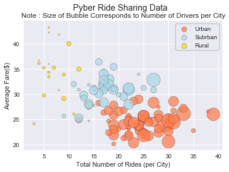
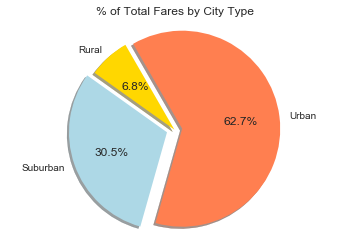
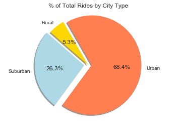
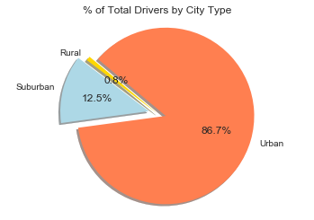

# Analysis
Pyber Observable Trends

The general observable trend is that, the number of drivers seems to increase with city classification with rural areas having the least amount of drivers per city and urban areas having more. However, there are urban areas that have similar number of drivers. Perhaps a study of population or geographic size versus number of drivers would be beneficial in exploring this trend.

It can be observed from the Bubble plot that the relationship between rides and Avg fare is not consistent. The data for Suburban and Urban types is more well defined. This could be due to the fact that drivers are more in numbers in the Urban and Suburban areas. This could be the reason for the Average fare in Urban areas not going above 30$. From the pie chart it can be inferred that, most of the revenue is generated by trips in Urban and Suburban areas. 

In addition to this, when looking at the pie charts, it can be inferred that 80% of Urban drivers contribute to over 60% of the total revenue and rides generated. While the Avg fare for the drivers in the Urban areas is not much, it can be seen that few drivers in Rural areas seem to get higher fares with lesser number of rides. While the number of rides in Rural areas is less, the avg fare is higher. More information about frequency of rides per day would help determine accurate data related to wages earned by drivers.

```python
import matplotlib.pyplot as plt
import pandas as pd
import numpy as np

```


```python
# Take in all of our wrestling data and read it into pandas
ride_df = pd.read_csv("raw_data/ride_data.csv")
city_df = pd.read_csv("raw_data/city_data.csv")
```


```python
#combine both CSV data into new Data Frame
combined_df = city_df.merge(ride_df, on = 'city')
combined_df.head()


```


<div>
<style scoped>
    .dataframe tbody tr th:only-of-type {
        vertical-align: middle;
    }

    .dataframe tbody tr th {
        vertical-align: top;
    }

    .dataframe thead th {
        text-align: right;
    }
</style>
<table border="1" class="dataframe">
  <thead>
    <tr style="text-align: right;">
      <th></th>
      <th>city</th>
      <th>driver_count</th>
      <th>type</th>
      <th>date</th>
      <th>fare</th>
      <th>ride_id</th>
    </tr>
  </thead>
  <tbody>
    <tr>
      <th>0</th>
      <td>Richardfort</td>
      <td>38</td>
      <td>Urban</td>
      <td>2018-02-24 08:40:38</td>
      <td>13.93</td>
      <td>5628545007794</td>
    </tr>
    <tr>
      <th>1</th>
      <td>Richardfort</td>
      <td>38</td>
      <td>Urban</td>
      <td>2018-02-13 12:46:07</td>
      <td>14.00</td>
      <td>910050116494</td>
    </tr>
    <tr>
      <th>2</th>
      <td>Richardfort</td>
      <td>38</td>
      <td>Urban</td>
      <td>2018-02-16 13:52:19</td>
      <td>17.92</td>
      <td>820639054416</td>
    </tr>
    <tr>
      <th>3</th>
      <td>Richardfort</td>
      <td>38</td>
      <td>Urban</td>
      <td>2018-02-01 20:18:28</td>
      <td>10.26</td>
      <td>9554935945413</td>
    </tr>
    <tr>
      <th>4</th>
      <td>Richardfort</td>
      <td>38</td>
      <td>Urban</td>
      <td>2018-04-17 02:26:37</td>
      <td>23.00</td>
      <td>720020655850</td>
    </tr>
  </tbody>
</table>
</div>


```python
#group by city
group_by_city = combined_df.groupby('city')

# ride count per city
rides_count = group_by_city['city'].count()

# city by city type
city_type = city_df.set_index('city')['type']

# Avg fare calculation per city
avg_fare = group_by_city['fare'].mean()

#driver count 
driver_count = group_by_city['driver_count'].sum()

#create new data frame
new_city_info = pd.DataFrame({"Number of Rides" : rides_count,
                           "Avg Fare" : avg_fare,
                           "Number of Drivers": driver_count,
                           "type" : city_type})


new_city_info.head()


```


<div>
<style scoped>
    .dataframe tbody tr th:only-of-type {
        vertical-align: middle;
    }

    .dataframe tbody tr th {
        vertical-align: top;
    }

    .dataframe thead th {
        text-align: right;
    }
</style>
<table border="1" class="dataframe">
  <thead>
    <tr style="text-align: right;">
      <th></th>
      <th>Avg Fare</th>
      <th>Number of Drivers</th>
      <th>Number of Rides</th>
      <th>type</th>
    </tr>
  </thead>
  <tbody>
    <tr>
      <th>Amandaburgh</th>
      <td>24.641667</td>
      <td>216</td>
      <td>18</td>
      <td>Urban</td>
    </tr>
    <tr>
      <th>Barajasview</th>
      <td>25.332273</td>
      <td>572</td>
      <td>22</td>
      <td>Urban</td>
    </tr>
    <tr>
      <th>Barronchester</th>
      <td>36.422500</td>
      <td>176</td>
      <td>16</td>
      <td>Suburban</td>
    </tr>
    <tr>
      <th>Bethanyland</th>
      <td>32.956111</td>
      <td>396</td>
      <td>18</td>
      <td>Suburban</td>
    </tr>
    <tr>
      <th>Bradshawfurt</th>
      <td>40.064000</td>
      <td>70</td>
      <td>10</td>
      <td>Rural</td>
    </tr>
  </tbody>
</table>
</div>


```python
# creating separate dfs for each city type
urban_df = new_city_info.loc[new_city_info['type']=="Urban"]
rural_df = new_city_info.loc[new_city_info['type']=="Rural"]
suburban_df = new_city_info.loc[new_city_info['type']=="Suburban"]
```

# Bubble plot of Rides Data


```python
# Create a scatter plot which compares rides to fare
import seaborn as sns
plt.scatter(urban_df['Number of Rides'],urban_df['Avg Fare'], s = urban_df['Number of Drivers']*0.25, marker = 'o', 
                                       facecolors ='Coral', alpha =0.75, edgecolors ='black', label = 'Urban')


plt.scatter(suburban_df['Number of Rides'],suburban_df['Avg Fare'], s = suburban_df['Number of Drivers']*0.75, marker = 'o', 
                                       facecolors ='lightblue', alpha =0.75, edgecolors ='black', label = 'Subrban')

plt.scatter(rural_df['Number of Rides'],rural_df['Avg Fare'], s = rural_df['Number of Drivers']*0.75, marker = 'o', 
                                       facecolors ='Gold', alpha =0.75, edgecolors ='black', label = 'Rural')


#print scatter plot
plt.suptitle('Pyber Ride Sharing Data')
plt.title('Note : Size of Bubble Corresponds to Number of Drivers per City')
plt.xlabel('Total Number of Rides (per City)')
plt.ylabel('Average Fare($)')


plt.grid(b=True, which='major', color='w', linewidth=1.0)
plt.grid(b=True, which='minor', color='w', linewidth=0.5)

lgnd = plt.legend(frameon = True, edgecolor = 'black')
lgnd.legendHandles[0]._sizes = [75]
lgnd.legendHandles[1]._sizes = [75]
lgnd.legendHandles[2]._sizes = [75]

plt.show()

```





# %Total Fares by City Type


```python
# group data by city Type
group_by_type = combined_df.groupby('type')
#group_by_type.head()
#total fare calculation
total_fare = group_by_type['fare'].sum()

labels = total_fare.index


# Tells matplotlib to seperate the "Python" section from the others
explode = (0, 0.08, 0.08)

colors = ['Gold','lightblue','coral']

plt.pie(total_fare, explode=explode, labels=labels, colors=colors,
        autopct="%1.1f%%", shadow=True,startangle=120)

#Title and axis
plt.title('% of Total Fares by City Type')
plt.axis('equal')
plt.show()

```





# Total Rides by city type


```python
# total Rides by city type

total_ride = group_by_type['ride_id'].count()

labels = total_ride.index


# Tells matplotlib to seperate the "Python" section from the others
explode = (0, 0.08, 0.08)

colors = ['Gold','lightblue','coral']

plt.pie(total_ride, explode=explode, labels=labels, colors=colors,
        autopct="%1.1f%%", shadow=True,startangle=120)

#Title and axis
plt.title('% of Total Rides by City Type')
plt.axis('equal')
plt.show()

```





# Drivers by city type


```python
# drivers by city type
total_driver = group_by_type ['driver_count'].sum()
labels = total_driver.index


# Tells matplotlib to seperate the "Python" section from the others
explode = (0, 0.1, 0.1)

colors = ['Gold','lightblue','coral']

plt.pie(total_driver, explode=explode, labels=labels, colors=colors,
        autopct="%1.1f%%", shadow=True,startangle=140)

#Title and axis
plt.title('% of Total Drivers by City Type')
plt.axis('equal')
plt.show()

```




